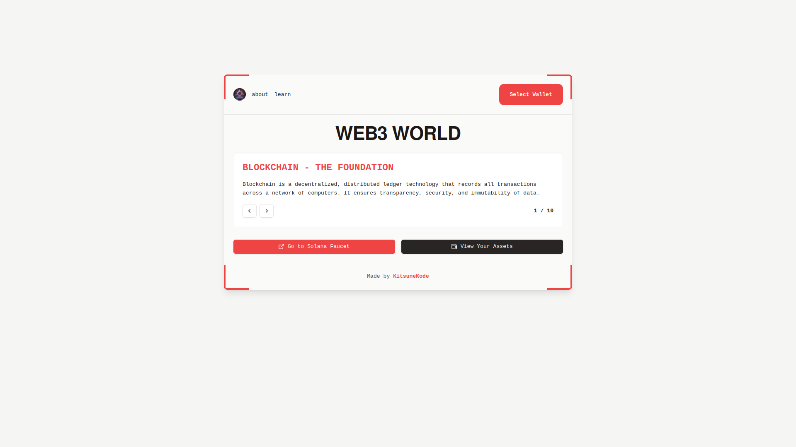

## Project Description

Mint Matrix is a Web3 platform that provides an interactive introduction to blockchain technology. It features a wallet connection, token management, and a Solana faucet for developers. The application is built with React,  and Solana Web3.js, and styled with Tailwind CSS.

  Project Link: [https://mint-matrix.vercel.app/](https://mint-matrix.vercel.app/)

## Table of Contents

1. [Features](#features)
2. [Components](#components)
3. [Prerequisites](#prerequisites)
4. [Installation](#installation)
5. [Usage](#usage)
6. [Technologies Used](#technologies-used)
7. [Contributing](#contributing)
8. [License](#license)

## Features

- 🎓 Interactive learning experience about Web3 technologies
- 👛 Wallet connection and management
- 💰 Token viewing and management
- 🚰 Solana faucet for development token requests
- 📱 Responsive design for various screen sizes

## Usage Demo

[Demo Video](https://github.com/user-attachments/assets/3ad77c12-4843-4ae6-9567-50d099b833fa)
  

## Components

### 1. Homepage (`Homepage.jsx`)

  

The homepage serves as the main entry point for users. It features:
- An introduction to Web3 concepts (Blockchain, Smart Contracts, DeFi)
- Wallet connection functionality
- Navigation to other sections of the application

### 2. Token Management (`MyTokens.jsx`)

  

This page allows users to view and manage their tokens. Key features include:
- Display of token balances and details
- Token sending functionality (simulated)
- Network switching between mainnet and devnet

### 3. Solana Faucet (`Airdrop.jsx`)

  

The faucet page enables developers to request Solana tokens for testing purposes. It includes:
- Airdrop request functionality for various SOL amounts
- Balance display and refresh
- Transaction signature copying

### 4 .  Authentication (`Authentication.jsx`)

The authentication modal asks users to sign a message to  prove ownership of a wallet!
- Write a Message
- Verify payment from wallet
- Access to other feature on success

  

## TODO

### 1.
  - [ ] Integrate the send token logic to enable real token transfers.
  
### 2. 
- [x] ~~Add authentication confirmation modal for user actions.~~

### 3.
-  [ ]  Fetch metadata from tokens of Token-Program v1!

## Prerequisites

- Node.js (v14 or later)
- npm or yarn
- A Solana wallet (e.g., Phantom, Solflare)

## Installation

1. Clone the repository:

git clone https://github.com/kitsunekode/mint-matrix.git

2. Navigate to the project directory:

cd mint-matrix

3. Install dependencies:

npm install
or

yarn install

## Usage

1. Start the development server:

npm run dev
or

yarn dev

2. Open your browser and navigate to `http://localhost:3000` (or the port specified in your console).

3. Connect your Solana wallet to interact with the application.

## Technologies Used

- React
- Solana Web3.js
- Tailwind CSS
- shadcn/ui components
- Lucide React icons

## Contributing

Contributions are welcome! Please feel free to submit a Pull Request.

## License

This project is licensed under the [MIT License](LICENSE).

